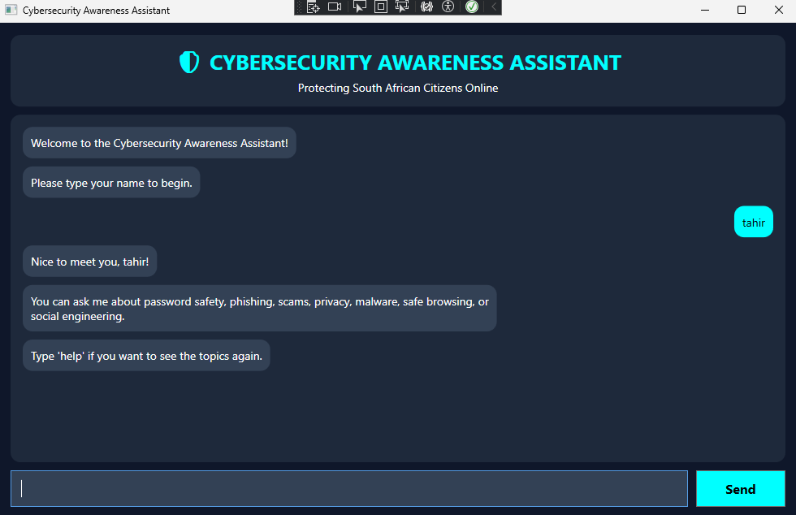
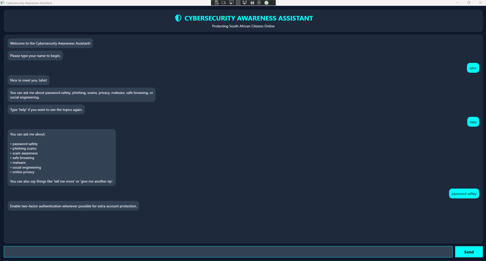
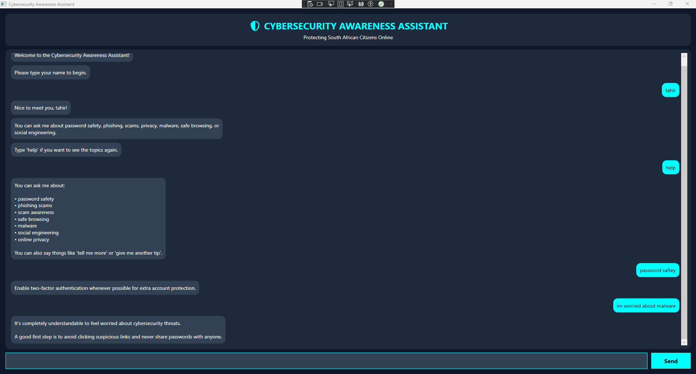
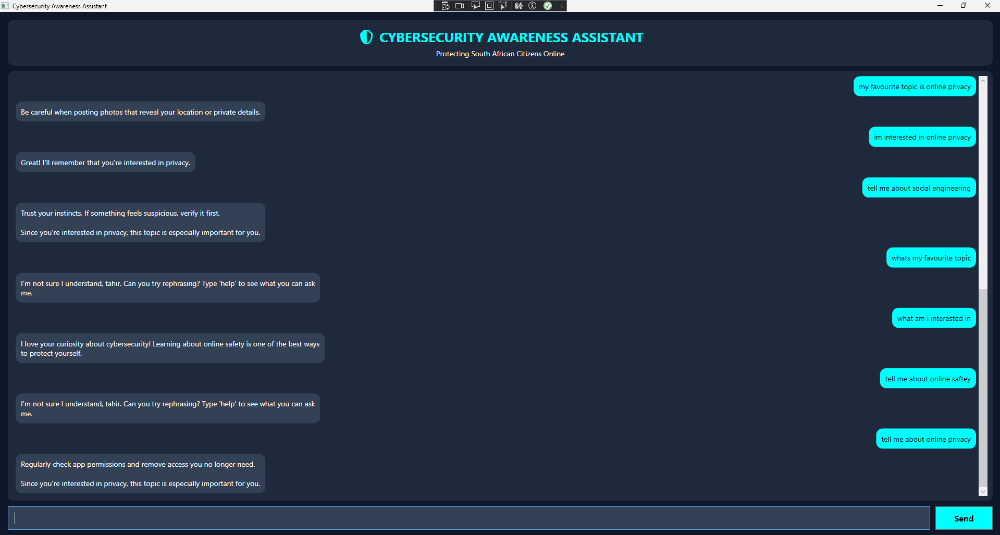

# Cybersecurity Awareness Chatbot – Part 2 (WPF GUI)

## Overview

This project is a Cybersecurity Awareness Chatbot developed in C# using Windows Presentation Foundation (WPF). The chatbot is designed to educate South African citizens about cybersecurity threats and online safety practices through an interactive graphical user interface.

The application allows users to interact with the chatbot in a conversational way while learning about important cybersecurity topics such as phishing, scams, password safety, privacy, malware, and safe browsing.

---

# Features

## GUI Interface

* Built using WPF (Windows Presentation Foundation)
* Left and right message chat bubbles
* Scrollable chat interface
* Has colour scheme and spacing

## Voice Greeting

* Plays a WAV audio greeting when the application launches
* Welcomes users to the chatbot 

## Keyword Recognition

The chatbot recognises cybersecurity-related keywords such as:

* Password
* Phishing
* Scam
* Privacy
* Malware
* Safe Browsing
* Social Engineering

## Random Responses

* The chatbot uses randomised responses for cybersecurity topics
* Prevents repetitive interactions
* Creates a more natural conversation flow

## Memory and Recall

* The chatbot remembers the user’s favourite cybersecurity topic
* Uses stored information later in the conversation to personalise responses

## Sentiment Detection

The chatbot detects simple user emotions such as:

* Worried
* Frustrated
* Curious

The bot responds empathetically based on the detected sentiment.

## Conversation Flow

The chatbot supports follow-up interactions such as:

* “Tell me more”
* “Another tip”
* “Explain more”

The chatbot remembers the previous topic and continues the conversation naturally.

## Error Handling

* Prevents empty user input
* Handles unknown topics gracefully
* Displays helpful fallback responses

---

# Technologies Used

* C#
* .NET
* Windows Presentation Foundation (WPF)
* Visual Studio
* GitHub

---

# How to Run the Application

1. Open the solution in Visual Studio.
2. Build the project.
3. Ensure that the `greeting.wav` file is inside the `Assets` folder.
4. Run the WPF project.
5. Enter your name and begin chatting with the chatbot.

---

# Example Questions

You can ask the chatbot questions such as:

* Tell me about phishing
* Give me a password tip
* I am worried about scams
* Tell me more
* Another tip
* Help

---

# Screenshots

Add screenshots of:

* Main chatbot GUI

* Chat conversation example

* Sentiment detection example

* Memory and recall example

---

# Video Demonstration

YouTube Video Link:

(Add your unlisted YouTube video link here)

---

